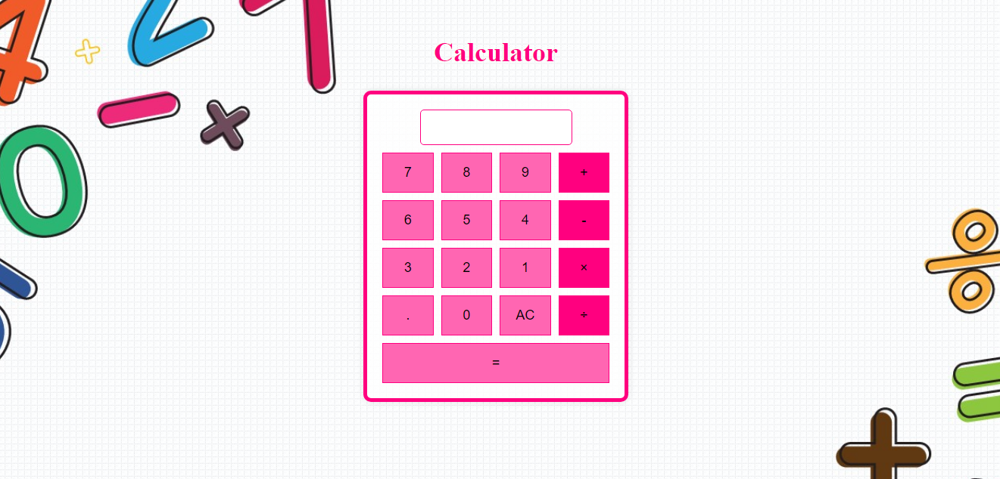

# Calculator

This repository contains a simple calculator web application built with HTML, CSS, and JavaScript. The calculator allows users to perform basic arithmetic operations, such as addition, subtraction, multiplication, and division.

## Features

- Addition, subtraction, multiplication, and division operations
- Clear display button (AC) to reset the input
- Error handling for invalid mathematical expressions
- Responsive design for various screen sizes

## Usage

To use the calculator, open the [Calculator Web App](https://emanmunir.github.io/Calculator/) link in a web browser. The calculator interface provides buttons for digits (0-9), decimal point (.), and operators (+, -, *, /). The "AC" button clears the display, and the "=" button calculates the result.

## Structure

- `index.html`: The main HTML file containing the calculator layout and structure.
- `calc.js`: JavaScript file with functions for appending to the display, clearing the display, and calculating the result.
- `calc.css`: Stylesheet for the calculator layout and appearance.

## Styling

The calculator has a visually appealing design with a pink color theme. The background image (`img1.jpg`) provides a dynamic and engaging backdrop for the calculator.

### CSS Styling Details

- `body`: Sets the font, size, text alignment, margin, background image, and color for the overall body.
- `.calculator`: Defines the styling for the calculator container, including border, padding, shadow, and background color.
- `.calculator__output`: Styles the output display area with specific colors, padding, border, and border-radius.
- `.calculator__keys`: Uses CSS Grid to arrange the calculator keys in a 4x4 grid layout with grid gap.
- `.calculator__key`: Styles the calculator keys with font size, padding, border, border-radius, background color, and cursor properties.
- `.calculator__key:hover`: Changes the background color of the keys on hover to enhance user interaction.
- `.calculator__key--operator`: Styles the operator keys with a different background color.
- `.calculator__key--operator:hover`: Changes the background color of operator keys on hover.
